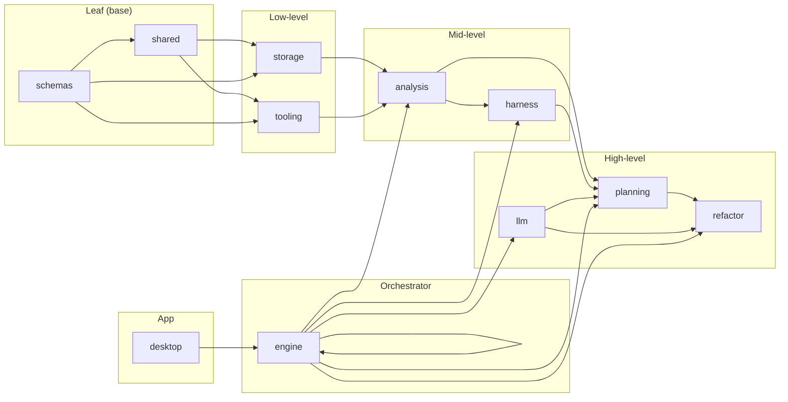

# هيكل المستودع — repo-refactor-ai

> مرسوم مفصل لهيكل جذر المستودع المحلي (بدون `node_modules` و `dist` و `build`)

---

## 1) شجرة ASCII

```
e:\team\  (repo-refactor-ai)
│
├── .editorconfig
├── .env.development
├── .env.production
├── .env.staging
├── .gitignore
├── AGENTS.md                    # توجيهات إلزامية للوكلاء
├── package.json                 # سكريبتات الجذر: build, lint, typecheck, engine:*
├── pnpm-lock.yaml
├── pnpm-workspace.yaml          # apps/* + packages/*
├── prettier.config.cjs
├── tsconfig.base.json
├── tsconfig.node.json
├── eslint.config.js             # Flat config + Boundaries
├── vitest.config.ts
│
├── .github/
│   └── workflows/
│       └── ci.yml               # CI pipeline
│
├── .minimax/                    # مهارات خارج نطاق المشروع الرئيسي
│   └── skills/
│       ├── minimax-docx/
│       ├── minimax-pdf/
│       ├── minimax-xlsx/
│       ├── openclaw-install/
│       └── windows-env-setup/
│
├── .uix/
│
├── apps/
│   └── desktop/                 # Electron Desktop App
│       ├── package.json
│       ├── tsconfig.json
│       ├── electron-builder.yml
│       └── src/
│           ├── main/            # Main process
│           │   ├── main.ts
│           │   └── ipc.ts
│           ├── preload/         # Preload script
│           │   └── preload.ts
│           └── renderer/         # React + Vite
│               ├── index.html
│               ├── vite.config.ts
│               ├── tsconfig.json
│               └── src/
│                   ├── main.tsx
│                   ├── app.tsx
│                   ├── api/
│                   ├── components/
│                   │   ├── common/
│                   │   ├── layout/
│                   │   ├── report/
│                   │   └── tables/
│                   ├── routes/
│                   ├── state/
│                   └── styles/
│
├── artifacts/                   # مخرجات تشغيل (غالبًا متجاهلة)
│
├── docs/
│   └── evidence-policy.md
│
├── dummy-project/               # مشروع تجريبي للاختبار
│   └── src/
│       ├── index.ts
│       ├── app.ts
│       └── utils.ts
│
└── packages/
    │
    ├── schemas/                  # Zod schemas + Types (مصدر الحقيقة)
    │   ├── package.json
    │   ├── tsconfig.json
    │   └── src/
    │       ├── index.ts
    │       ├── evidence.ts
    │       ├── findings.ts
    │       ├── graphs.ts
    │       ├── plan.ts
    │       ├── report.ts
    │       └── telemetry.ts
    │
    ├── shared/                   # logging + helpers + fs/glob
    │   ├── package.json
    │   ├── tsconfig.json
    │   └── src/
    │       ├── index.ts
    │       ├── crypto/
    │       │   └── index.ts
    │       ├── fs/
    │       │   ├── index.ts
    │       │   └── index.test.ts
    │       ├── log/
    │       │   └── index.ts
    │       └── proc/
    │           └── index.ts
    │
    ├── tooling/                  # تشغيل أدوات التحليل (بدون قرارات)
    │   ├── package.json
    │   ├── tsconfig.json
    │   └── src/
    │       └── index.ts
    │
    ├── storage/                  # SQLite + artifact store
    │   ├── package.json
    │   ├── tsconfig.json
    │   └── src/
    │       ├── index.ts
    │       ├── artifacts/
    │       └── db/
    │           ├── client.ts
    │           ├── client.test.ts
    │           ├── migrate.ts
    │           └── schema.sql
    │
    ├── analysis/                 # استخراج الأدلة (بدون تعديل repo الهدف)
    │   ├── package.json
    │   ├── tsconfig.json
    │   └── src/
    │       ├── contracts/
    │       ├── detectors/
    │       │   ├── dead-code.ts
    │       │   └── dead-code.test.ts
    │       ├── evidence/
    │       ├── graphs/
    │       │   ├── call-graph.ts
    │       │   └── import-graph.ts
    │       ├── indexer/
    │       │   └── ts-morph.ts
    │       ├── repo/
    │       │   └── entrypoints.ts
    │       ├── risk/
    │       └── semantic-clones/
    │
    ├── harness/                  # Behavioral Equivalence Harness (Vitest)
    │   ├── package.json
    │   ├── tsconfig.json
    │   └── src/
    │       ├── index.ts
    │       ├── generators/
    │       │   └── snapshot.ts
    │       └── runner/
    │           └── before-after.ts
    │
    ├── planning/                 # Evidence gatekeeper + planner + approval gate
    │   ├── package.json
    │   ├── tsconfig.json
    │   └── src/
    │       ├── index.ts
    │       ├── approval-gate.ts
    │       ├── evidence-gatekeeper.ts
    │       └── planner.ts
    │
    ├── refactor/                 # تنفيذ الخطة (codemods + git)
    │   ├── package.json
    │   ├── tsconfig.json
    │   └── src/
    │       ├── index.ts
    │       ├── codemods/
    │       │   └── index.ts
    │       └── git/
    │           └── index.ts
    │
    ├── llm/                      # providers + router + prompts
    │   ├── package.json
    │   ├── tsconfig.json
    │   ├── .env.example
    │   └── src/
    │       ├── index.ts
    │       ├── profiles.ts
    │       ├── agent-mapping.ts
    │       ├── router.ts
    │       ├── prompt-loader.ts
    │       ├── generate-json.ts
    │       ├── json.ts
    │       ├── prompts/
    │       │   ├── _base_system.md
    │       │   ├── planner-prompt.ts
    │       │   └── agents/
    │       │       ├── intake.md
    │       │       ├── ts-stack-profiler.md
    │       │       ├── indexer.md
    │       │       ├── graph-builder.md
    │       │       ├── dead-code-hunter.md
    │       │       ├── semantic-clone-clustering.md
    │       │       ├── duplicate-function.md
    │       │       ├── boundaries-merge.md
    │       │       ├── contract-miner.md
    │       │       ├── risk-scorer.md
    │       │       ├── refactor-planner-report.md
    │       │       ├── evidence-gatekeeper.md
    │       │       └── patch-author.md
    │       └── providers/
    │           ├── index.ts
    │           ├── types.ts
    │           ├── openai.ts
    │           ├── openai-compatible.ts
    │           ├── anthropic.ts
    │           ├── google.ts
    │           └── mistral.ts
    │
    └── engine/                   # orchestrator + CLI + telemetry + API للـ Electron
        ├── package.json
        ├── tsconfig.json
        ├── artifacts/
        │   ├── db/
        │   └── runs/
        │       └── run_*/
        │           ├── findings/
        │           └── plan/
        └── src/
            ├── index.ts
            ├── agents/
            │   ├── types.ts
            │   ├── index.ts
            │   ├── intake.agent.ts
            │   ├── indexer.agent.ts
            │   ├── graph-builder.agent.ts
            │   ├── dead-code-hunter.agent.ts
            │   ├── semantic-clone-clustering.agent.ts
            │   ├── duplicate-function.agent.ts
            │   ├── boundaries-merge.agent.ts
            │   ├── contract-miner.agent.ts
            │   ├── risk-scorer.agent.ts
            │   ├── refactor-planner-report.agent.ts
            │   └── evidence-gatekeeper.agent.ts
            ├── api/
            ├── cli/
            │   ├── index.ts
            │   ├── scan.ts
            │   ├── plan.ts
            │   ├── apply.ts
            │   └── verify.ts
            ├── orchestrator/
            │   ├── nodes.ts
            │   ├── state.ts
            │   └── checkpoints.ts
            └── telemetry/
```


---

## 3) مخطط الاعتماديات بين الحزم



---

## 4) ملخص سريع

| المسار | الوصف |
|--------|-------|
| `apps/desktop` | تطبيق Electron (Main + Preload + Renderer React) |
| `packages/schemas` | Zod schemas + Types (مصدر الحقيقة) |
| `packages/shared` | logging, fs, helpers, crypto, proc |
| `packages/tooling` | wrappers لأدوات التحليل (knip, depcheck, etc.) |
| `packages/storage` | SQLite + artifact store |
| `packages/analysis` | استخراج الأدلة، graphs، detectors |
| `packages/harness` | Vitest harness داخل repo الهدف |
| `packages/planning` | Evidence gatekeeper، planner، approval gate |
| `packages/refactor` | تنفيذ codemods + git |
| `packages/llm` | providers (OpenAI, Anthropic, Google, Mistral) + prompts |
| `packages/engine` | orchestrator + CLI + API للـ Electron |

---

## 5) أوامر التشغيل

```bash
pnpm -r build         # بناء كل الحزم
pnpm dev              # تشغيل تطبيق الديسكتوب
pnpm engine:scan      # مسح المستودع
pnpm engine:plan      # توليد الخطة
pnpm engine:apply     # تنفيذ الخطة
pnpm engine:verify    # التحقق
```
