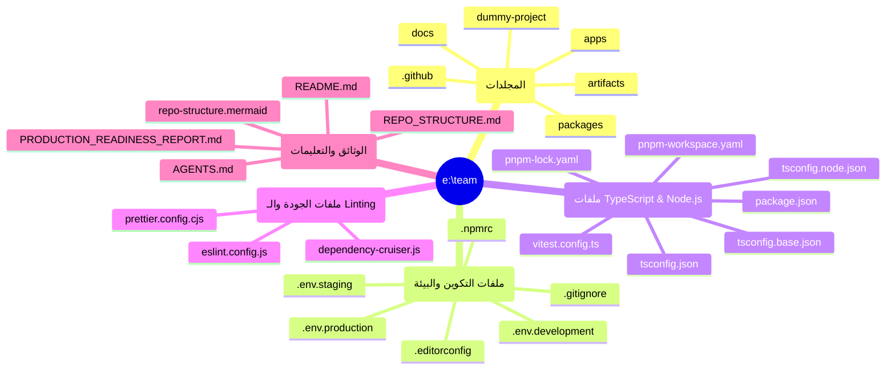

# هيكل المستودع الشامل (Full Repository Structure)

تم تحديث هذا الملف لعرض **جميع الملفات والمجلدات** الموجودة في المستودع (من الجذر وحتى أعمق مجلد)، مع استبعاد الملفات غير الضرورية مثل `node_modules` و `dist` و `.git` لتجنب الضوضاء البصرية.

## 1. خريطة ذهنية سريعة (High-Level Mindmap)
*(ملاحظة: الخريطة الذهنية تعرض فقط المكونات الرئيسية للجذر لتجنب الفوضى البصرية، بينما الرسم الشجري بالأسفل يعرض كل شيء بالتفصيل).*



## 2. الهيكل الشجري الشامل (Full ASCII Tree)

```text
e:\team
├── 📁 .github
│   └── 📁 workflows
│       └── 📄 ci.yml
├── 📁 apps
│   └── 📁 desktop
│       ├── 📁 src
│       │   ├── 📁 main
│       │   │   ├── 📄 ipc.ts
│       │   │   └── 📄 main.ts
│       │   ├── 📁 preload
│       │   │   └── 📄 preload.ts
│       │   └── 📁 renderer
│       │       ├── 📁 src
│       │       │   ├── 📁 api
│       │       │   ├── 📁 components
│       │       │   │   ├── 📁 common
│       │       │   │   ├── 📁 layout
│       │       │   │   ├── 📁 report
│       │       │   │   └── 📁 tables
│       │       │   ├── 📁 routes
│       │       │   ├── 📁 state
│       │       │   ├── 📁 styles
│       │       │   ├── 📄 app.tsx
│       │       │   └── 📄 main.tsx
│       │       ├── 📄 index.html
│       │       ├── 📄 tsconfig.json
│       │       └── 📄 vite.config.ts
│       ├── 📄 electron-builder.yml
│       ├── 📄 package.json
│       └── 📄 tsconfig.json
├── 📁 artifacts
│   └── 📄 PROMPTS_REPORT.md
├── 📁 docs
│   ├── 📄 architecture.md
│   ├── 📄 boundaries.md
│   ├── 📄 evidence-policy.md
│   ├── 📄 risk-scoring.md
│   └── 📄 ui-spec.md
├── 📁 dummy-project
│   ├── 📁 src
│   │   ├── 📄 app.ts
│   │   ├── 📄 index.ts
│   │   └── 📄 utils.ts
│   ├── 📄 package.json
│   └── 📄 tsconfig.json
├── 📁 packages
│   ├── 📁 analysis
│   │   ├── 📁 src
│   │   │   ├── 📁 contracts
│   │   │   ├── 📁 detectors
│   │   │   │   ├── 📄 dead-code.test.ts
│   │   │   │   └── 📄 dead-code.ts
│   │   │   ├── 📁 evidence
│   │   │   ├── 📁 graphs
│   │   │   │   ├── 📄 call-graph.ts
│   │   │   │   └── 📄 import-graph.ts
│   │   │   ├── 📁 indexer
│   │   │   │   ├── 📄 references.ts
│   │   │   │   └── 📄 ts-morph.ts
│   │   │   ├── 📁 repo
│   │   │   │   └── 📄 entrypoints.ts
│   │   │   ├── 📁 risk
│   │   │   ├── 📁 semantic-clones
│   │   │   └── 📄 index.ts
│   │   ├── 📄 package.json
│   │   └── 📄 tsconfig.json
│   ├── 📁 engine
│   │   ├── 📁 artifacts
│   │   │   ├── 📁 db
│   │   │   │   └── 📄 refactor.sqlite
│   │   │   └── 📁 runs
│   │   │       ├── 📁 run_5018cb0db1f53073
│   │   │       │   ├── 📁 findings
│   │   │       │   │   └── 📄 findings.json
│   │   │       │   └── 📁 plan
│   │   │       │       └── 📄 plan.json
│   │   │       ├── 📁 run_8d3a31259b852952
│   │   │       │   └── 📁 findings
│   │   │       │       └── 📄 findings.json
│   │   │       ├── 📁 run_cb9f967120c2ff31
│   │   │       │   └── 📁 findings
│   │   │       │       └── 📄 findings.json
│   │   │       └── 📁 run_d6fbff26a77ebc2c
│   │   │           └── 📁 findings
│   │   │               └── 📄 findings.json
│   │   ├── 📁 src
│   │   │   ├── 📁 agents
│   │   │   │   ├── 📄 boundaries-merge.agent.ts
│   │   │   │   ├── 📄 contract-miner.agent.ts
│   │   │   │   ├── 📄 dead-code-hunter.agent.ts
│   │   │   │   ├── 📄 duplicate-function.agent.ts
│   │   │   │   ├── 📄 evidence-gatekeeper.agent.ts
│   │   │   │   ├── 📄 graph-builder.agent.ts
│   │   │   │   ├── 📄 index.ts
│   │   │   │   ├── 📄 indexer.agent.ts
│   │   │   │   ├── 📄 intake.agent.ts
│   │   │   │   ├── 📄 refactor-planner-report.agent.ts
│   │   │   │   ├── 📄 risk-scorer.agent.ts
│   │   │   │   ├── 📄 semantic-clone-clustering.agent.ts
│   │   │   │   ├── 📄 ts-stack-profiler.agent.ts
│   │   │   │   └── 📄 types.ts
│   │   │   ├── 📁 api
│   │   │   ├── 📁 cli
│   │   │   │   ├── 📄 apply.ts
│   │   │   │   ├── 📄 index.ts
│   │   │   │   ├── 📄 plan.ts
│   │   │   │   ├── 📄 scan.ts
│   │   │   │   └── 📄 verify.ts
│   │   │   ├── 📁 orchestrator
│   │   │   │   ├── 📄 checkpoints.ts
│   │   │   │   ├── 📄 graph.ts
│   │   │   │   ├── 📄 index.ts
│   │   │   │   ├── 📄 nodes.ts
│   │   │   │   └── 📄 state.ts
│   │   │   ├── 📁 telemetry
│   │   │   └── 📄 index.ts
│   │   ├── 📄 package.json
│   │   └── 📄 tsconfig.json
│   ├── 📁 harness
│   │   ├── 📁 src
│   │   │   ├── 📁 generators
│   │   │   │   └── 📄 snapshot.ts
│   │   │   ├── 📁 runner
│   │   │   │   └── 📄 before-after.ts
│   │   │   └── 📄 index.ts
│   │   ├── 📄 package.json
│   │   └── 📄 tsconfig.json
│   ├── 📁 llm
│   │   ├── 📁 src
│   │   │   ├── 📁 prompts
│   │   │   │   ├── 📁 agents
│   │   │   │   │   ├── 📄 boundaries-merge.md
│   │   │   │   │   ├── 📄 contract-miner.md
│   │   │   │   │   ├── 📄 dead-code-hunter.md
│   │   │   │   │   ├── 📄 duplicate-function.md
│   │   │   │   │   ├── 📄 evidence-gatekeeper.md
│   │   │   │   │   ├── 📄 graph-builder.md
│   │   │   │   │   ├── 📄 indexer.md
│   │   │   │   │   ├── 📄 intake.md
│   │   │   │   │   ├── 📄 patch-author.md
│   │   │   │   │   ├── 📄 refactor-planner-report.md
│   │   │   │   │   ├── 📄 risk-scorer.md
│   │   │   │   │   ├── 📄 semantic-clone-clustering.md
│   │   │   │   │   └── 📄 ts-stack-profiler.md
│   │   │   │   ├── 📄 _base_system.md
│   │   │   │   └── 📄 planner-prompt.ts
│   │   │   ├── 📁 providers
│   │   │   │   ├── 📄 anthropic.ts
│   │   │   │   ├── 📄 google.ts
│   │   │   │   ├── 📄 index.ts
│   │   │   │   ├── 📄 mistral.ts
│   │   │   │   ├── 📄 openai-compatible.ts
│   │   │   │   ├── 📄 openai.ts
│   │   │   │   └── 📄 types.ts
│   │   │   ├── 📄 agent-mapping.ts
│   │   │   ├── 📄 generate-json.ts
│   │   │   ├── 📄 index.ts
│   │   │   ├── 📄 json.ts
│   │   │   ├── 📄 profiles.ts
│   │   │   ├── 📄 prompt-loader.ts
│   │   │   └── 📄 router.ts
│   │   ├── 📄 .env.example
│   │   ├── 📄 package.json
│   │   └── 📄 tsconfig.json
│   ├── 📁 planning
│   │   ├── 📁 src
│   │   │   ├── 📄 approval-gate.ts
│   │   │   ├── 📄 evidence-gatekeeper.ts
│   │   │   ├── 📄 index.ts
│   │   │   └── 📄 planner.ts
│   │   ├── 📄 package.json
│   │   └── 📄 tsconfig.json
│   ├── 📁 refactor
│   │   ├── 📁 src
│   │   │   ├── 📁 codemods
│   │   │   │   └── 📄 index.ts
│   │   │   ├── 📁 git
│   │   │   │   └── 📄 index.ts
│   │   │   └── 📄 index.ts
│   │   ├── 📄 package.json
│   │   └── 📄 tsconfig.json
│   ├── 📁 schemas
│   │   ├── 📁 src
│   │   │   ├── 📄 evidence.ts
│   │   │   ├── 📄 findings.ts
│   │   │   ├── 📄 graphs.ts
│   │   │   ├── 📄 index.ts
│   │   │   ├── 📄 plan.ts
│   │   │   ├── 📄 report.ts
│   │   │   └── 📄 telemetry.ts
│   │   ├── 📄 package.json
│   │   └── 📄 tsconfig.json
│   ├── 📁 shared
│   │   ├── 📁 src
│   │   │   ├── 📁 crypto
│   │   │   │   └── 📄 index.ts
│   │   │   ├── 📁 fs
│   │   │   │   ├── 📄 index.test.ts
│   │   │   │   └── 📄 index.ts
│   │   │   ├── 📁 log
│   │   │   │   └── 📄 index.ts
│   │   │   ├── 📁 proc
│   │   │   │   └── 📄 index.ts
│   │   │   └── 📄 index.ts
│   │   ├── 📄 package.json
│   │   └── 📄 tsconfig.json
│   ├── 📁 storage
│   │   ├── 📁 src
│   │   │   ├── 📁 artifacts
│   │   │   │   ├── 📄 paths.ts
│   │   │   │   ├── 📄 reader.ts
│   │   │   │   └── 📄 writer.ts
│   │   │   ├── 📁 db
│   │   │   │   ├── 📄 client.test.ts
│   │   │   │   ├── 📄 client.ts
│   │   │   │   ├── 📄 migrate.ts
│   │   │   │   └── 📄 schema.sql
│   │   │   └── 📄 index.ts
│   │   ├── 📄 package.json
│   │   └── 📄 tsconfig.json
│   └── 📁 tooling
│       ├── 📁 src
│       │   └── 📄 index.ts
│       ├── 📄 package.json
│       └── 📄 tsconfig.json
├── 📄 .editorconfig
├── 📄 .env.development
├── 📄 .env.production
├── 📄 .env.staging
├── 📄 .gitignore
├── 📄 .npmrc
├── 📄 AGENTS.md
├── 📄 dependency-cruiser.js
├── 📄 eslint.config.js
├── 📄 package.json
├── 📄 pnpm-lock.yaml
├── 📄 pnpm-workspace.yaml
├── 📄 prettier.config.cjs
├── 📄 PRODUCTION_READINESS_REPORT.md
├── 📄 README.md
├── 📄 REPO_STRUCTURE.md
├── 📄 repo-structure.mermaid
├── 📄 roo-code-settings.json
├── 📄 tsconfig.base.json
├── 📄 tsconfig.json
├── 📄 tsconfig.node.json
└── 📄 vitest.config.ts
```